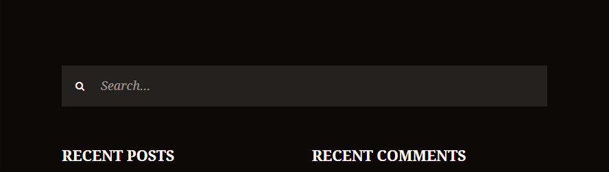
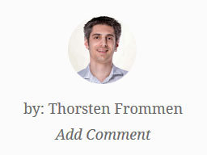
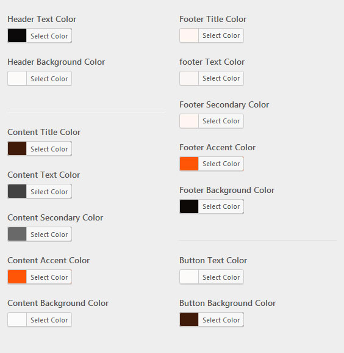
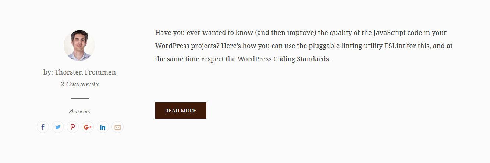

# Snowbirdie

> A [Snowbird](https://wordpress.org/themes/snowbird/) child theme.

## Table of Contents

* [Installation](#installation)
* [Changes](#changes)
  * [Actions](#actions)
  * [Additions](#additions)
  * [Style](#style)
  * [Template Parts](#template-parts)
* [Demo](#demo)
* [License](#license)

## Installation

Snowbirdie provides a `composer.json` file so you can install it via [Composer](https://getcomposer.org/):

```shell
$ composer require tfrommen/snowbirdie
```

You can also just [use the generated ZIP file](https://github.com/tfrommen/snowbirdie/releases).

**Notice:** Since Snowbirdie is a **child theme**, you need to have [Snowbird](https://wordpress.org/themes/snowbird/) installed as well.

## Changes

The following sections list all changes (i.e., customizations as well as additions) that will be put in effect when installing Snowbirdie.

### Actions

#### `snowbirdie.after_footer_widgets`

Snowbirdie provides the `snowbirdie.after_footer_widgets` action hook that is fired right after the footer widgets. Hooking there allows you to inject markup after the footer widgets.

#### `snowbirdie.before_footer_widgets`

Snowbirdie provides the `snowbirdie.before_footer_widgets` action hook that is fired right before the footer widgets. Hooking there allows you to inject markup before the footer widgets.

### Additions

#### Author Bio Sidebar

Snowbirdie provides an additional widget area, _Author Bio_ (`'author-bio'`), that is located right after the author bio.

#### Footer Widgets

Snowbirdie provides a full-width search input in the footer, just before the widgets.



### Style

#### Author Bio

Snowbirdie wraps the author bio in `<p />` tags by using `wpautop()`.

Furthermore, the whole author bio section is pushed below the content when in mobile view.

#### Avatar

Snowbirdie uses rounded borders on avatars.



#### Color Scheme

Snowbirdie provides an additional color scheme: _snowbirdie_.



#### Content Width

Snowbirdie uses a content width of 1280 pixels (instead of the original 1110 pixels).

#### Excerpt

Snowbirdie displays a Read More button below every excerpt, no matter if generated or not.



#### Footer Text

Snowbirdie renders a footer text that consists of a copyright notice for the current year, the title of the site, and the description.


#### Image Sizes

Snowbirdie uses the following customized image sizes (all cropped center|center):

* Featured Image: 1920 x 720
* _Snowbird Large_: 1280 x 480
* _Snowbird Thumb_: 400 x 400
* _Snowbird Small_: 120 x 120

#### Links

Snowbirdie decorates all links inside posts with an underline.

### Template Parts

#### Featured Image

Snowbirdie displays a `<figcaption />` element containing the featured image's caption, if exists.


#### Loop Sidebar

Snowbirdie always lists the author (i.e., avatar and name) of each post, no matter if there only is one author on the site.

#### Post Meta

For single post view, Snowbirdie also includes the number of comments in the post meta section.


## Demo

If you would like to see Snowbirdie in action, please refer to [my personal website](https://tfrommen.de).

## License

This code is licensed under the [GNU General Public License](LICENSE).
